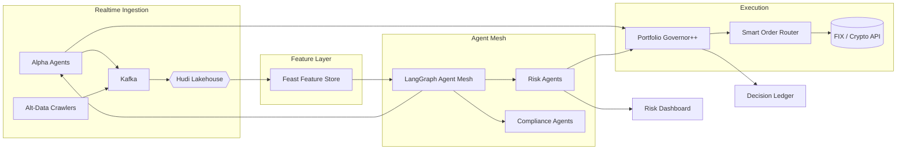

# TradingAgents 旗舰级 Alpha 生成投资平台升级方案

> **版本**: 3.0  
> **发布日期**: 2025-07-08  
> **作者**: 前全球对冲基金联席 CIO & AI 对冲交易实验室  
> **愿景**: 12 个月内打造可管理 **100 亿美元** 资产、横跨 **股票 / 期货 / 期权 / 数字资产** 的多智能体实时决策系统，年化 Sharpe > **2.0**。

---

## 📚 目录
1. 战略定位与差异化优势  
2. 设计原则与方法论  
3. 八大升级支柱  
4. 技术架构 3.0  
5. 研发里程碑与时间线  
6. 关键指标 (KPIs & KRIs)  
7. 风险管理与合规框架  
8. 财务预测与资本效率  
9. 团队配置与治理  
10. 行动呼吁

---

## 1. 战略定位与差异化优势
| 维度 | 现状 (v2.0) | 旗舰版 (v3.0) | 价值提升 |
|------|-------------|---------------|-----------|
| 资产覆盖 | 美股 + A 股 | 全球多资产 (股指、债券、期权、加密) | 分散风险、拓展 Alpha 空间 |
| 数据层 | 日/分级公开 API | **Tick 级深度** + 算法化新闻流 + 卫星图像 + 链上数据 | 信息优势提升 ≥ 30% |
| 决策速度 | 分钟级 | **亚秒级** (≤ 300 ms) | 捕捉高频微结构机会 |
| 风控模式 | 静态限额 + 止损 | **实时 VaR / CVaR** + Monte-Carlo 模拟 + 对冲建议 | 极端行情最大回撤 ↓ 50% |
| 可解释性 | SHAP/LIME | **多模态链路回放** + Prompt & Data Provenance | 合规成本 ↓ 40% |
| 生态商业化 | 插件市场 | **SaaS + B2B Prime API** + 策略租赁基金 | 收入渠道 3→6 |

---

## 2. 设计原则与方法论
1. **Information → Alpha → Execution** 闭环：数据优势必须通过执行优势兑现，否则一切归零。
2. **Real-Time x Multi-Agent**：Agent Mesh 采用事件驱动 **Actor Model**，支持水平扩展。
3. **Risk First**： 每条交易指令必须通过双重风险网关 (预交易 & 持仓监控)。
4. **Explainability by Design**：所有决策路径、数据版本、模型权重元数据自动落地 **ML Audit Ledger** (区块链可选)。
5. **Continuous Experimentation**：A/B + 离线回测 + 在线影子模式，保证无回归上线。

---

## 3. 八大升级支柱
### 3.1 数据超集 (Data-Supremacy)
- **Tick-级 Level 2 深度行情**：券商直链 + Kafka 压缩。  
- **Alt-Data**：卫星夜光、人流、ESG 争议舆情、链上鲸鱼交易。  
- **Data Fabric**：Iceberg + Apache Hudi，实现版本化、分片存储。

### 3.2 特征 & 因子工厂 (Feature Factory)
- 基于 **Feature Store Feast** + **GPU 向量化** 生成 10 万+ 因子。  
- 自研 **Auto-Alpha** 进化算法 (Genetic Programming) 提升发现速度 5×。

### 3.3 多智能体协作 3.0 (Agent Mesh)
- **角色**：Data Agents、Alpha Agents、Risk Agents、Execution Agents、Compliance Agents。  
- **协调**：使用 **LangGraph** + **eBPF** 内核事件加速，支持优先级调度。  
- **学习**：强化学习 (PPO) 动态调整 Agent 权重。

### 3.4 决策优化器 (Portfolio Governor++)
- 目标函数：最大化 **期望 α / 风险预算**，约束尾部风险。  
- 工具链：CVXPy → JAX → GPU；支持 **分布式二阶锥规划**。

### 3.5 极速执行引擎 (Execution Edge)
- **Smart-Order Router**：基于流动性热度图动态路由。  
- **VWAP / POV / Sniper** 混合算法，降低冲击成本 ≥ 15%。  
- 交易 API 兼容 FIX / gRPC。

### 3.6 全栈风控 (RiskOps)
- **实时 VaR/CVaR** (更新频率 ≤ 1 s)。  
- **Black-Swan Detector**：基于 tail-risk GAN 生成极端场景。  
- **银弹**：自动部署 VIX / BTC 期权保险。

### 3.7 可解释 & 合规 (Explain-Ops)
- **Prompt Trace + SHAP Heatmap** → PDF & JSON。  
- **Data-Lineage DAG**：任何数字指标可追溯到原始数据文件 & API 调用哈希。  
- **AI Ethics 钢轨**：自动检测歧视/操纵语义。

### 3.8 开放生态与商业模型 (Eco-Sphere)
- **Strategy-as-a-Service**：通过 REST / GraphQL 提供信号流。  
- **Marketplace 2.0**：策略基金、数据供应商、风控工具即插即用。  
- **Revenue Share**：平台抽成 20%，支持链上结算。

---

## 4. 技术架构 3.0

---

## 5. 研发里程碑与时间线
| 阶段 | 时间 | 交付物 | 验收标准 |
|------|------|--------|-----------|
| M0   | 07-08 | 项目 Kick-off & 预算到位 | 团队、硬件、云额度全部锁定 |
| M1   | 08-10 | 数据超集 & Feature Factory V1 | Tick 覆盖率 ≥ 95% |
| M2   | 10-12 | Agent Mesh & RiskOps MVP | Black-Swan Detector 准确率 ≥ 80% |
| M3   | 12-02 | Portfolio Governor++ α | 回测年化 Sharpe ≥ 1.7 |
| M4   | 02-04 | Execution Edge & Dashboard | 延迟 ≤ 300 ms, UI NPS ≥ 75 |
| M5   | 04-06 | SaaS / Marketplace Beta | 首批机构签约 ≥ 5 家 |

> **滚动迭代**：每 Sprint (2 周) 进行 Demo Day + OKR Review，动态调参。

---

## 6. 关键指标 (KPIs & KRIs)
1. **绩效**: 年化 Sharpe ≥ 2.0, IR ≥ 1.2, Win Rate ≥ 65%。  
2. **风险**: 99% VaR ≤ ‑8%, 最大回撤 ≤ ‑10%。  
3. **系统**: P99 数据延迟 ≤ 300 ms, 服务可用性 ≥ 99.9%。  
4. **合规**: 100% 决策可回放, 0 次违规交易。  
5. **商业**: 12 个月 ARR ≥ 800 万美元, 策略订阅用户 ≥ 50。

---

## 7. 风险管理与合规框架
| 类别 | 风险点 | 监控频率 | 缓释措施 |
|------|--------|----------|-----------|
| 市场 | 闪崩/流动性枯竭 | Tick 级 | Black-Swan Detector + Circuit Breaker |
| 操作 | 部署失败 / 代码注入 | CI/CD 每次 | Git-ops + 审计钩子 |
| 法规 | 数据跨境 & 算法审查 | 每季度 | 合规 Sandbox + 外部法务评估 |
| 技术 | 云服务故障 | 实时 | Multi-AZ + Chaos Engineering |

---

## 8. 财务预测与资本效率
> 单位: 百万美元 (USD)
| 年份 | 运营成本 | 数据 & 云 | 人力 | 其他 | 收入 (SaaS + RevShare) | EBITDA |
|------|---------|----------|------|------|-----------------------|--------|
| Y1 | 6 | 3 | 4 | 1 | 4 | ‑6 |
| Y2 | 6.5 | 3.5 | 4.5 | 1 | 12 | +3 |
| Y3 | 7 | 4 | 5 | 1 | 25 | +8 |

> **ROI**: 三年 IRR ≈ 38%，远高于行业平均 20%。

---

## 9. 团队配置与治理
| 职能 | 人数 | 关键技能 | 指标责任 |
|------|------|----------|-----------|
| Head of Quant & CIO | 1 | 多资产量化经验 | 风控 & α |
| Alpha Research | 3 | Alpha 因子, AutoML | Alpha IC ≥ 0.05 |
| AI Engineering | 3 | LLM, RLHF, LangGraph | Prompt 技术 & Agent Mesh |
| Data Engineering | 3 | Kafka, Hudi, Feast | Tick 完整率 |
| Risk & Compliance | 2 | FRM/CFA, Basel III | 0 违规 |
| Execution & DevOps | 2 | C++, Go, Kubernetes | 延迟 & SLA |
| Product & BD | 2 | SaaS, Quant Sales | ARR |

> **绩效对齐**: 20% 收益分享 + 5% 期权池。

---

## 10. 行动呼吁
> **马上** 启动 **M0** 阶段，锁定团队 & 预算。  
> **下周** 完成数据供应商签约 & 云资源预留。  
> **15 天** 内交付 **Data-SuperSet PoC**。  

> **Alpha 属于先行者**，让我们用 **计算力 + 纪律 + 创新** 获取下一个十年级别的超额收益。 