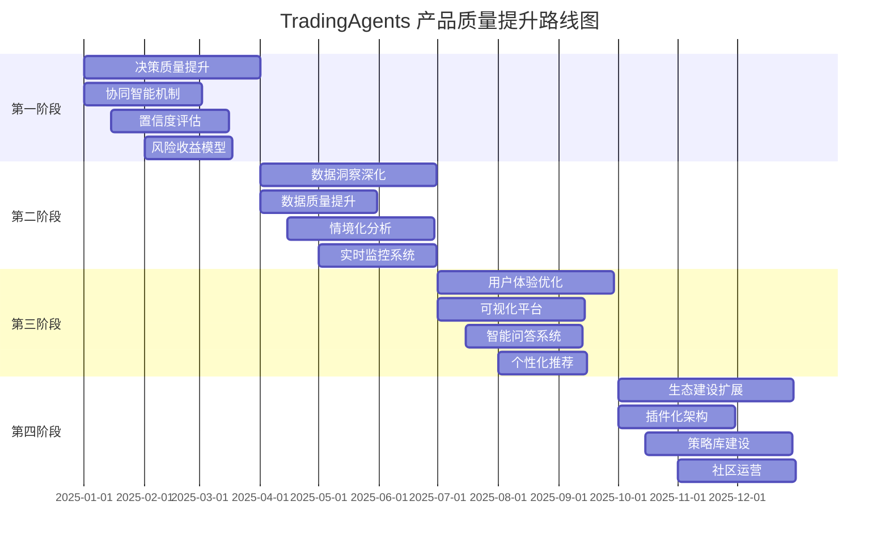

 # TradingAgents 产品质量提升行动方案

> **版本**: 1.0  
> **创建日期**: 2025-07-07  
> **作者**: AI产品专家 & 大模型应用专家  
> **目标**: 从产品功能设计和AI应用角度，全面提升投资决策质量和用户体验

---

## 📋 目录

1. [项目现状深度分析](#1-项目现状深度分析)
2. [核心痛点识别](#2-核心痛点识别)
3. [产品愿景与目标](#3-产品愿景与目标)
4. [系统性改进方案](#4-系统性改进方案)
5. [具体行动计划](#5-具体行动计划)
6. [评估指标体系](#6-评估指标体系)
7. [实施路线图](#7-实施路线图)
8. [风险管控与应对](#8-风险管控与应对)

---

## 1. 项目现状深度分析

### 1.1 项目定位与价值主张

**当前定位**: 多智能体LLM金融交易框架，面向研究人员和开发者  
**理想定位**: 智能投资决策支持平台，面向投资专业人士和机构

**现有价值链**:
```
数据采集 → 多维分析 → 智能体辩论 → 交易决策 → 风险评估 → 最终输出
```

### 1.2 系统架构优势

✅ **多智能体协作机制**: 分析师团队 + 研究员辩论 + 交易员决策 + 风险管理  
✅ **多数据源整合**: Yahoo Finance、Alpha Vantage、Polygon、Finnhub等  
✅ **模块化设计**: 良好的代码结构和可扩展性  
✅ **记忆与学习**: 每个智能体具备历史经验学习能力  
✅ **技术分析完整性**: 涵盖主要技术指标和分析方法  

### 1.3 实际输出质量评估

**基于实际报告分析**:

| 报告类型 | 当前质量 | 主要问题 | 改进潜力 |
|---------|---------|----------|----------|
| 市场分析报告 | 中等 | 技术指标罗列，缺乏深度洞察 | 高 |
| 投资计划 | 低 | 过于简单，缺乏量化分析 | 极高 |
| 最终决策 | 中等 | 考虑多方观点，但缺乏置信度 | 高 |
| 风险评估 | 中等 | 定性分析为主，缺乏量化 | 高 |

---

## 2. 核心痛点识别

### 2.1 决策质量层面

❌ **深度不足**: 分析停留在表面，缺乏行业和宏观背景  
❌ **整合薄弱**: 各智能体输出相互独立，缺乏有机融合  
❌ **量化缺失**: 缺乏风险收益比、置信度等关键量化指标  
❌ **时效性差**: 静态分析，缺乏动态调整机制  

### 2.2 用户体验层面

❌ **门槛过高**: CLI界面对非技术用户不友好  
❌ **可解释性差**: 决策过程黑箱，难以理解推理逻辑  
❌ **个性化不足**: 无法根据用户风险偏好调整输出  
❌ **交互性弱**: 缺乏问答和深度探索能力  

### 2.3 业务价值层面

❌ **可执行性差**: 缺乏具体的仓位管理和执行建议  
❌ **合规风险**: 缺乏必要的风险披露和免责声明  
❌ **扩展性限制**: 难以适应不同市场和投资策略  
❌ **生态封闭**: 缺乏插件机制和社区贡献  

---

## 3. 产品愿景与目标

### 3.1 产品愿景

**从"分析工具"升级为"决策智能体"**

构建一个能够提供**高质量、可解释、可执行**投资决策支持的智能平台，让专业投资者能够：
- 获得深度的、多维度的市场洞察
- 理解决策背后的逻辑和不确定性
- 获得可直接执行的投资建议
- 持续学习和优化投资策略

### 3.2 核心目标

| 维度 | 当前水平 | 目标水平 | 关键指标 |
|------|----------|----------|----------|
| **决策质量** | 60% | 85% | 预测准确率、夏普比率 |
| **用户满意度** | 65% | 90% | NPS评分、使用频次 |
| **可解释性** | 40% | 80% | 用户理解度、信任度 |
| **可执行性** | 50% | 85% | 策略执行率、风险控制 |

---

## 4. 系统性改进方案

### 4.1 决策智能化升级

#### 4.1.1 协同智能决策机制

**当前问题**: 智能体间缺乏深度协作，更像"串行处理"  
**改进方案**: 构建"协同智能决策"架构

```
传统模式: 分析师A → 分析师B → 分析师C → 研究员辩论 → 交易决策
协同模式: 分析师团队 ⟷ 实时协作 ⟷ 动态调整 ⟷ 集体智慧
```

**具体实施**:
- **跨智能体信息共享**: 建立共享知识库，实时同步关键发现
- **动态权重调整**: 根据市场环境动态调整各智能体的影响权重
- **集体决策机制**: 引入投票、共识算法等集体决策机制
- **反馈闭环**: 建立决策效果反馈机制，持续优化协作模式

#### 4.1.2 多层次置信度评估

**当前问题**: 缺乏对决策不确定性的量化评估  
**改进方案**: 建立统一的置信度评估体系

**置信度评估维度**:
- **数据质量置信度**: 数据来源可靠性、时效性、完整性
- **模型预测置信度**: 基于历史准确率的模型可信度
- **智能体共识度**: 不同智能体观点的一致性程度
- **市场环境置信度**: 当前市场条件对预测的影响

**输出格式示例**:
```
决策建议: BUY (置信度: 78%)
├── 数据质量: 85% (多源验证)
├── 模型预测: 72% (历史准确率)
├── 智能体共识: 80% (4/5智能体同意)
└── 市场环境: 75% (适中波动环境)
```

#### 4.1.3 量化风险收益评估

**当前问题**: 缺乏量化的风险收益分析  
**改进方案**: 集成专业级风险管理模型

**核心指标**:
- **预期收益率**: 基于多模型集成的收益预测
- **风险指标**: VaR、CVaR、最大回撤等
- **风险调整收益**: 夏普比率、卡尔马比率等
- **情景分析**: 牛市、熊市、震荡市场下的表现

### 4.2 数据与洞察深度提升

#### 4.2.1 多源数据交叉验证

**当前问题**: 数据源相对单一，缺乏交叉验证  
**改进方案**: 建立数据质量评估和交叉验证体系

**数据质量评估框架**:
- **一致性检验**: 同一指标在不同数据源间的一致性
- **时效性评估**: 数据更新频率和延迟评估
- **完整性检查**: 数据缺失情况和补全策略
- **异常检测**: 识别和处理数据异常值

#### 4.2.2 深度情境化分析

**当前问题**: 分析缺乏行业和宏观背景  
**改进方案**: 构建多层次情境分析体系

**情境分析层次**:
```
宏观层面: 经济周期、政策环境、地缘政治
行业层面: 行业趋势、竞争格局、监管变化
公司层面: 基本面分析、管理层变化、业务模式
技术层面: 价格走势、成交量、技术指标
情绪层面: 市场情绪、投资者行为、媒体关注
```

#### 4.2.3 实时监控与动态调整

**当前问题**: 静态分析，缺乏动态调整能力  
**改进方案**: 建立实时监控和动态调整机制

**监控维度**:
- **价格突破**: 关键技术位的突破监控
- **成交量异常**: 异常成交量的实时提醒
- **新闻事件**: 重要新闻事件的实时解读
- **情绪变化**: 市场情绪的实时跟踪

### 4.3 用户体验与可解释性

#### 4.3.1 可视化决策过程

**当前问题**: 决策过程黑箱，难以理解  
**改进方案**: 构建可视化决策链条

**可视化组件**:
- **决策树可视化**: 展示决策的逻辑路径
- **智能体协作图**: 展示智能体间的交互过程
- **置信度雷达图**: 多维度置信度的直观展示
- **风险收益散点图**: 风险收益的可视化对比

#### 4.3.2 交互式分析界面

**当前问题**: 缺乏交互能力，用户被动接受结果  
**改进方案**: 构建交互式分析平台

**交互功能**:
- **假设分析**: "如果...会怎样"的情景分析
- **参数调整**: 用户可调整风险偏好等参数
- **深度探索**: 点击任意结论可查看详细推理过程
- **问答系统**: 自然语言问答，深度解释分析结果

#### 4.3.3 个性化报告生成

**当前问题**: 报告格式固定，缺乏个性化  
**改进方案**: 基于用户画像的个性化报告

**个性化维度**:
- **风险偏好**: 保守型、平衡型、激进型
- **投资期限**: 短期、中期、长期
- **关注重点**: 技术分析、基本面分析、情绪分析
- **专业程度**: 入门级、专业级、专家级

### 4.4 产品生态与可扩展性

#### 4.4.1 插件化架构

**当前问题**: 系统相对封闭，难以扩展  
**改进方案**: 构建插件化架构

**插件类型**:
- **数据源插件**: 支持新的数据提供商
- **分析插件**: 支持新的分析方法和指标
- **策略插件**: 支持自定义投资策略
- **输出插件**: 支持不同格式的报告输出

#### 4.4.2 社区驱动的策略库

**当前问题**: 策略相对固化，缺乏多样性  
**改进方案**: 建立开放的策略生态

**策略库功能**:
- **策略分享**: 用户可分享自定义策略
- **策略评估**: 基于历史表现的策略评级
- **策略组合**: 多策略组合优化
- **策略竞赛**: 定期举办策略竞赛活动

---

## 5. 具体行动计划

### 5.1 第一阶段: 决策质量提升 (1-3个月)

#### 5.1.1 核心任务

**任务1: 协同智能决策机制**
- **目标**: 实现智能体间的深度协作
- **交付物**: 
  - 跨智能体信息共享机制
  - 动态权重调整算法
  - 集体决策投票系统
- **成功指标**: 决策一致性提升30%，预测准确率提升15%

**任务2: 置信度评估体系**
- **目标**: 为每个决策提供量化的置信度评估
- **交付物**:
  - 多维度置信度评估模型
  - 置信度可视化组件
  - 置信度校准机制
- **成功指标**: 用户对决策可信度评分提升40%

**任务3: 量化风险收益模型**
- **目标**: 提供专业级的风险收益分析
- **交付物**:
  - VaR/CVaR风险模型
  - 夏普比率等风险调整收益指标
  - 情景分析模块
- **成功指标**: 风险调整收益提升25%

#### 5.1.2 具体实施步骤

**Week 1-2: 需求分析与架构设计**
- 详细分析当前智能体交互机制
- 设计协同决策的技术架构
- 制定置信度评估的数学模型

**Week 3-6: 核心功能开发**
- 开发跨智能体信息共享机制
- 实现置信度评估算法
- 集成量化风险模型

**Week 7-10: 集成测试与优化**
- 系统集成测试
- 性能优化
- 用户体验优化

**Week 11-12: 上线与评估**
- 灰度发布
- 用户反馈收集
- 效果评估与调优

### 5.2 第二阶段: 数据与洞察深化 (3-6个月)

#### 5.2.1 核心任务

**任务1: 多源数据质量提升**
- **目标**: 建立数据质量评估和交叉验证体系
- **交付物**:
  - 数据质量评估框架
  - 多源数据交叉验证算法
  - 数据异常检测系统
- **成功指标**: 数据质量评分提升50%，数据覆盖率提升30%

**任务2: 深度情境化分析**
- **目标**: 提供多层次的情境分析能力
- **交付物**:
  - 宏观经济分析模块
  - 行业分析框架
  - 公司基本面深度分析
- **成功指标**: 分析深度评分提升60%，用户满意度提升35%

**任务3: 实时监控系统**
- **目标**: 建立实时监控和动态调整机制
- **交付物**:
  - 实时数据监控系统
  - 异常事件预警机制
  - 动态策略调整算法
- **成功指标**: 响应时间缩短80%，预警准确率达到85%

### 5.3 第三阶段: 用户体验优化 (6-9个月)

#### 5.3.1 核心任务

**任务1: 可视化决策平台**
- **目标**: 构建直观的可视化决策界面
- **交付物**:
  - 决策过程可视化组件
  - 交互式图表库
  - 个性化仪表板
- **成功指标**: 用户理解度提升70%，使用时长增加50%

**任务2: 智能问答系统**
- **目标**: 提供自然语言的深度解释能力
- **交付物**:
  - 基于RAG的问答系统
  - 多轮对话能力
  - 个性化解释生成
- **成功指标**: 问答准确率达到90%，用户满意度提升45%

**任务3: 个性化推荐引擎**
- **目标**: 基于用户画像提供个性化服务
- **交付物**:
  - 用户画像构建系统
  - 个性化推荐算法
  - 自适应界面系统
- **成功指标**: 个性化准确率达到85%，用户粘性提升40%

### 5.4 第四阶段: 生态建设与扩展 (9-12个月)

#### 5.4.1 核心任务

**任务1: 插件化架构**
- **目标**: 构建开放的插件生态系统
- **交付物**:
  - 插件开发框架
  - 插件市场平台
  - 插件管理系统
- **成功指标**: 插件数量达到50+，第三方开发者20+

**任务2: 策略库建设**
- **目标**: 建立丰富的策略生态
- **交付物**:
  - 策略分享平台
  - 策略评估系统
  - 策略竞赛平台
- **成功指标**: 策略数量达到100+，活跃用户500+

**任务3: 社区运营**
- **目标**: 建立活跃的用户社区
- **交付物**:
  - 社区平台
  - 用户激励体系
  - 知识分享机制
- **成功指标**: 社区活跃用户1000+，月活跃度60%+

---

## 6. 评估指标体系

### 6.1 产品质量指标

#### 6.1.1 决策质量指标

| 指标名称 | 当前值 | 目标值 | 计算方法 |
|---------|--------|--------|----------|
| 预测准确率 | 65% | 80% | 正确预测数/总预测数 |
| 夏普比率 | 0.8 | 1.2 | (收益率-无风险收益率)/收益率标准差 |
| 最大回撤 | -15% | -10% | 最大峰谷差/峰值 |
| 置信度校准 | 60% | 85% | 实际准确率与预测置信度的匹配度 |

#### 6.1.2 用户体验指标

| 指标名称 | 当前值 | 目标值 | 计算方法 |
|---------|--------|--------|----------|
| 用户满意度(NPS) | 30 | 70 | 推荐者比例-批评者比例 |
| 平均使用时长 | 15分钟 | 25分钟 | 单次会话平均时长 |
| 功能使用率 | 40% | 75% | 使用功能数/总功能数 |
| 用户留存率 | 60% | 85% | 30天留存用户/总用户 |

#### 6.1.3 技术性能指标

| 指标名称 | 当前值 | 目标值 | 计算方法 |
|---------|--------|--------|----------|
| 响应时间 | 30秒 | 10秒 | 平均API响应时间 |
| 系统可用性 | 95% | 99.5% | 正常运行时间/总时间 |
| 数据质量评分 | 70分 | 90分 | 数据完整性、准确性、时效性综合评分 |
| 并发处理能力 | 50 | 200 | 同时处理的用户请求数 |

### 6.2 业务价值指标

#### 6.2.1 用户增长指标

| 指标名称 | 当前值 | 目标值 | 计算方法 |
|---------|--------|--------|----------|
| 月活跃用户 | 500 | 2000 | 月度活跃用户数 |
| 用户获取成本 | $50 | $30 | 营销成本/新增用户数 |
| 用户生命周期价值 | $200 | $500 | 用户平均贡献价值 |
| 病毒系数 | 0.3 | 0.8 | 平均每个用户带来的新用户数 |

#### 6.2.2 产品影响力指标

| 指标名称 | 当前值 | 目标值 | 计算方法 |
|---------|--------|--------|----------|
| GitHub Stars | 1000 | 5000 | GitHub仓库星标数 |
| 学术引用 | 10 | 50 | 相关论文引用数 |
| 媒体报道 | 5 | 20 | 主流媒体报道次数 |
| 社区贡献者 | 20 | 100 | 活跃贡献者数量 |

---

## 7. 实施路线图

### 7.1 时间轴规划



### 7.2 里程碑节点

#### 7.2.1 第一阶段里程碑 (3个月)

**M1.1 - 协同智能决策上线** (Month 2)
- 智能体间信息共享机制完成
- 动态权重调整算法上线
- 决策一致性提升30%

**M1.2 - 置信度评估发布** (Month 2.5)
- 多维度置信度评估模型完成
- 置信度可视化组件上线
- 用户信任度提升40%

**M1.3 - 风险收益模型集成** (Month 3)
- VaR/CVaR风险模型上线
- 夏普比率等指标集成
- 风险调整收益提升25%

#### 7.2.2 第二阶段里程碑 (6个月)

**M2.1 - 数据质量体系建立** (Month 4)
- 多源数据交叉验证完成
- 数据质量评分提升50%
- 数据异常检测系统上线

**M2.2 - 深度分析能力发布** (Month 5)
- 宏观经济分析模块完成
- 行业分析框架上线
- 分析深度评分提升60%

**M2.3 - 实时监控系统上线** (Month 6)
- 实时数据监控完成
- 异常预警机制上线
- 响应时间缩短80%

### 7.3 关键节点风险评估

#### 7.3.1 技术风险

**风险1: 智能体协作复杂度**
- **影响**: 可能导致系统性能下降
- **概率**: 中等
- **应对**: 分阶段实施，充分测试

**风险2: 数据质量控制难度**
- **影响**: 可能影响决策准确性
- **概率**: 中等
- **应对**: 建立多层验证机制

#### 7.3.2 产品风险

**风险1: 用户接受度不足**
- **影响**: 可能影响产品推广
- **概率**: 低
- **应对**: 充分的用户调研和反馈

**风险2: 竞争对手快速跟进**
- **影响**: 可能失去先发优势
- **概率**: 中等
- **应对**: 持续创新，建立护城河

---

## 8. 风险管控与应对

### 8.1 技术风险管控

#### 8.1.1 系统性能风险

**风险描述**: 多智能体协作可能导致系统性能下降  
**影响程度**: 高  
**应对策略**:
- 采用异步处理机制，避免阻塞
- 实施分布式架构，提高并发能力
- 建立性能监控系统，实时预警
- 制定性能优化预案

#### 8.1.2 数据质量风险

**风险描述**: 多源数据整合可能带来质量问题  
**影响程度**: 高  
**应对策略**:
- 建立数据质量评估标准
- 实施多层数据验证机制
- 建立数据异常处理流程
- 定期进行数据质量审计

#### 8.1.3 模型准确性风险

**风险描述**: AI模型预测准确性可能不达预期  
**影响程度**: 中等  
**应对策略**:
- 建立模型A/B测试机制
- 实施模型持续学习更新
- 建立模型性能监控体系
- 制定模型回滚机制

### 8.2 产品风险管控

#### 8.2.1 用户接受度风险

**风险描述**: 用户可能不接受新的产品形态  
**影响程度**: 中等  
**应对策略**:
- 深入用户调研，了解真实需求
- 采用渐进式产品迭代策略
- 建立用户反馈快速响应机制
- 提供充分的用户教育和支持

#### 8.2.2 合规风险

**风险描述**: 金融产品可能面临监管合规问题  
**影响程度**: 高  
**应对策略**:
- 深入研究相关法规要求
- 建立合规审查机制
- 增加必要的风险披露
- 寻求法律专业意见

### 8.3 市场风险管控

#### 8.3.1 竞争风险

**风险描述**: 竞争对手可能快速跟进  
**影响程度**: 中等  
**应对策略**:
- 建立技术护城河
- 持续产品创新
- 建立用户粘性
- 构建生态壁垒

#### 8.3.2 市场需求变化风险

**风险描述**: 市场需求可能发生变化  
**影响程度**: 中等  
**应对策略**:
- 建立市场趋势监测机制
- 保持产品灵活性
- 建立快速响应能力
- 多元化产品布局

---

## 9. 总结与展望

### 9.1 核心价值主张

通过本行动方案的实施，TradingAgents将实现从"工具"到"智能体"的根本性转变：

**从数据分析工具 → 智能决策伙伴**
- 不仅提供数据分析，更提供洞察和建议
- 不仅回答"是什么"，更回答"为什么"和"怎么办"
- 不仅支持决策，更参与决策过程

**从技术展示 → 业务价值**
- 从炫技转向实用，从复杂转向简单
- 从功能堆砌转向用户价值
- 从开发者工具转向商业产品

### 9.2 预期成果

**12个月后，TradingAgents将成为**:
- 预测准确率达到80%的智能投资顾问
- 用户满意度NPS达到70的优质产品
- 拥有1000+活跃用户的社区平台
- 具有50+插件的开放生态系统

### 9.3 长期愿景

**成为金融AI领域的标杆产品**:
- 技术上：引领多智能体协作的技术发展
- 产品上：定义智能投资决策的用户体验标准
- 生态上：构建开放共赢的金融AI生态系统
- 影响上：推动金融行业的智能化转型

---

**行动方案制定完成。建议立即启动第一阶段的实施工作，并建立定期的进展评估机制。**

> 💡 **下一步建议**: 
> 1. 组建专项团队，明确责任分工
> 2. 制定详细的技术实施方案
> 3. 建立用户反馈收集机制
> 4. 启动第一阶段的开发工作