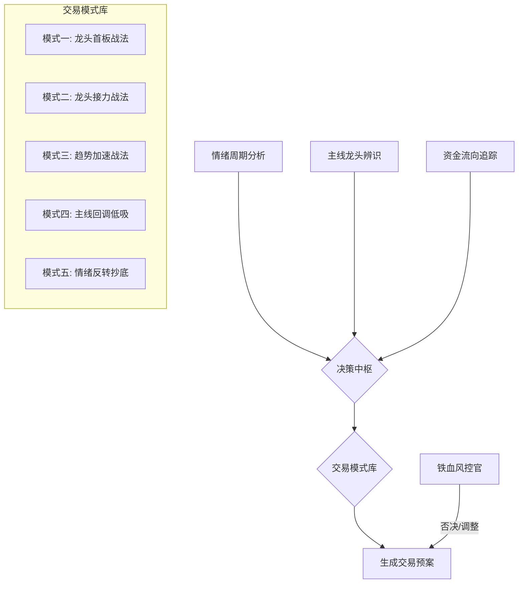
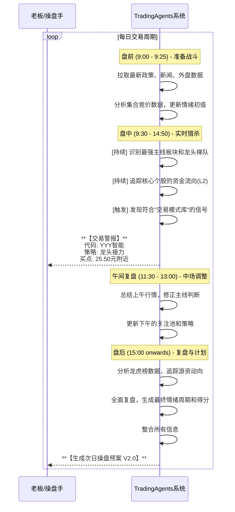

# TradingAgents 实战化改造升级方案 - A股印钞机核心蓝图

> **版本**: 绝密 1.0  
> **作者**: A股职业操盘手  
> **目标**: 摒弃纸上谈兵，注入实战灵魂，将 TradingAgents 改造为一部专注于中国A股市场的短线/波段交易印钞机。

---

## 📋 开篇点题：从"分析工具"到"交易武器"

我审阅了项目组之前的两份《行动方案》。坦率地说，那两份方案在产品规划和AI技术应用上具备一定的理论高度，但它们最大的问题是 **"学院派"** 通病：**离实战太远，离人性太远，离A股的"水土"太远**。

A股市场，尤其是短线和波段交易，本质是一场围绕 **"情绪"** 和 **"资金"** 的高维博弈。技术指标、基本面分析固然重要，但它们往往是滞后的，甚至是主力资金用来迷惑散户的烟雾弹。

因此，我们的升级核心，不是去堆砌更多的"分析师"智能体，也不是去优化那些大而全的"报告"，而是要建立一套真正符合A股生态的 **"交易系统"**。这个系统必须能回答三个核心问题：

1.  **市场在想什么？（情绪）**
2.  **聪明的钱在干什么？（资金）**
3.  **我应该怎么干？（策略）**

---

## 1. 核心理念：A股实战交易的四大支柱

在开始改造前，必须统一思想。忘掉华尔街那套"价值投资"的陈词滥调，在中国做短线，你必须理解并信奉以下四大支柱：

| 支柱 | 核心解读 | 对系统的要求 |
| --- | --- | --- |
| **情绪周期** | A股是情绪市。情绪有如潮汐，从冰点、启动、发酵、高潮，到分歧、退潮、冰点，周而复始。在周期正确的位置做正确的事，事半功倍。 | 系统必须能 **量化并识别当前市场所处的情绪周期阶段**。 |
| **龙头战法** | 每一个阶段的上涨，都由一个核心板块（主线）和其中的龙头股（总龙头/板块龙头）引领。抓住龙头，就能吃到最肥美的肉。 | 系统必须能 **第一时间识别市场主线和各级龙头**。 |
| **资金为王** | 股价的短期涨跌由资金驱动。要跟随市场中最聪明、最凶悍的资金（俗称"游资"或"热钱"），看懂它们的动向。 | 系统必须能 **深度分析和追踪活跃资金的流向和行为**。 |
| **铁血纪律** | 这是交易的生命线。再好的系统，没有纪律也会亏钱。止损、止盈、仓位管理，必须像呼吸一样自然。 | 系统必须内置 **不可违背的交易纪律和风控规则**。 |

---

## 2. 改造行动：三层架构的"手术刀"式升级

我们将对原有的数据层、智能体层、决策层进行"外科手术"般的精准改造。

### 第一刀：数据层 - 注入A股的"血液"

当前的数据源（Yahoo Finance, Finnhub等）主要是海外市场的标配，对A股的覆盖颗粒度远远不够。必须引入以下 **A股特色数据源**：

- **核心数据**:
    - **龙虎榜数据**: 每日必读，分析顶级游资和机构的席位动向，是追踪聪明钱的核心。
    - **实时概念/行业板块数据**: A股炒作的是"概念"，必须实时追踪板块资金流入、涨速、强度。
    - **每日涨跌停数据**: 涨停板是A股情绪的温度计，炸板率、连板高度等都是关键情绪指标。
    - **北向/南向资金流**: 观察外资动向，判断大盘蓝筹股的趋势。
- **进阶数据**:
    - **十档行情/逐笔成交 (Level-2)**: 高阶功能，用于分析个股的盘中主力资金意图，如大单净量、挂单变化等。
    - **财经新闻/政策快讯**: 结合情绪分析，判断事件驱动的可持续性。
    - **社交平台情绪数据**: 从雪球、东方财富股吧等平台抓取非结构化情绪数据。

**行动计划**:
1.  **构建A股特色数据库**: 整合上述数据源，建立统一的、高时效性的数据中心。
2.  **数据清洗与标签化**: 对数据进行预处理，例如给个股打上"龙头"、"跟风"、"趋势"、"妖股"等实战标签。

### 第二刀：智能体层 - 从"分析师"到"操盘手"

抛弃原有模糊的智能体定义，重塑为分工明确的 **"操盘手团队"**：

| 原智能体 | **升级后实战智能体** | 核心职责 |
| --- | --- | --- |
| Market/News Analyst | **情绪周期分析师** | - 综合涨跌停、成交量、市场热度，判断当前市场情绪阶段（冰点/启动/高潮/退潮）。 - 输出 **"环境安全分"**，指导仓位。 |
| Bull/Bear Researcher | **主线龙头辨识器** | - 识别当前最强的1-3个主线板块。 - 锁定每个主线板块的龙头梯队（龙一、龙二、补涨龙）。 |
| Fundamentals Analyst | **资金流向追踪器** | - 深度解析龙虎榜，建立"游资席位画像"，追踪其动向。 - 结合Level-2数据，分析盘中主力资金行为。 |
| Risk Manager | **铁血风控官** | - **强制执行纪律**：例如 `-5%` 必须止损，高位放量必须减仓。 - **管理仓位**：根据情绪周期和交易信号，动态调整总仓位。 |
| Trader | **交易策略执行官** | - 综合所有信息，匹配下文提到的 **"交易模式库"**，生成具体的交易计划。 |

### 第三刀：决策层 - 注入"稳赢"的交易模式

这是本次升级的灵魂。交易不是简单的"买/卖"，而是基于特定市场模式的 **"战法"**。系统必须内置一个标准化的 **"A股短线高胜率交易模式库"**。

**交易模式库（示例）**:

- **龙头首板战法**:
    - **触发条件**: 市场情绪回暖期，某概念板块突发利好，板块强度飙升，第一个涨停的个股。
    - **买点**: 涨停封板前，或封板后次日集合竞价。
    - **卖点**: 次日冲高无力，或2-3板后开板。
- **龙头接力战法**:
    - **触发条件**: 市场情绪主升浪，总龙头已确立（2-3板以上），出现分歧换手。
    - **买点**: 分歧日（如T字板、十字星）的尾盘或次日低开后转强时。
    - **卖点**: 加速赶顶后，出现第一个大阴线或放量滞涨。

**行动计划**:
1.  **模式定义**: 将经典的A股战法（如低位启动、N字板、反包等）进行量化和代码化。
2.  **动态匹配**: 决策中枢根据实时市场数据，自动匹配最合适的交易模式。

---

## 3. 输出优化：从"研究报告"到"操盘预案"

没人有时间看长篇大论的报告。输出必须是 **一目了然、可直接执行** 的作战指令。

**新版"每日操盘预案"格式 (v2.0 范例)**:

| **项目** | **内容** | **示例** |
| --- | --- | --- |
| **一、大势研判** | **情绪周期**: `高潮期 (第2天)` **情绪得分**: `8.5/10` (昨日7.0) 🔼 **盘面解读**: 市场热度持续攀升，连板高度达到6板，赚钱效应扩散。但高位分歧开始加剧，需警惕退潮风险。 **仓位建议**: `总仓位7成` (进攻为主，防御为辅)。 |
| **二、主线梳理** | **最强主线**: `[T0] 人工智能` (板块得分: 95, 资金净流入: +50亿) **次强主线**: `[T1] 国防军工` (板块得分: 82, 资金净流入: +25亿) **潜在主线**: `[T2] 新能源车` (板块得分: 70, 有资金回流迹象) |
| **三、龙头追踪** | **市场总龙头**: `XXX光电 (002XXX)` (6连板, 人工智能) **人工智能梯队**:   - `龙一`: `XXX光电 (002XXX)` (6B)   - `龙二`: `YYY智能 (300YYY)` (3B)   - `中军`: `ZZZ科技 (600ZZZ)` (趋势新高) **军工梯队**:   - `龙一`: `AAA导航 (001AAA)` (2B) |
| **四、今日作战计划** | **【核心关注池 (Core Watchlist)】** 1. **`YYY智能 (300YYY)` - 接力**    - **逻辑**: AI主线中位龙头，今日有换手转一致预期。    - **买点**: `25.50元` 附近 (分歧转一致点)    - **止损**: `24.20元` (前日收盘价)    - **仓位**: `2成` 2. **`BBB材料 (601BBB)` - 首板**    - **逻辑**: 新能源车板块异动，该股为板块内首个封板，有卡位潜力。    - **买点**: `12.00元` (封板瞬间或次日竞价)    - **止损**: `11.40元` (-5%硬止损)    - **仓位**: `1成` **【备选观察池 (Alternative Watchlist)】**  - `ZZZ科技 (600ZZZ)` - 趋势低吸  - `AAA导航 (001AAA)` - 弱转强观察 |
| **五、风控与纪律** | **今日主要风险**: 总龙头断板导致的情绪全面退潮。 **操作纪律**: 计划外交易严禁。亏损个股绝不补仓。持仓股若跌破5日线，无条件先减半。 |

---

## 4. 实战化系统工作流 (附：每日作战时序)

为了让您清晰地看到这套"交易武器"每天是如何自动化运转的，我绘制了以下工作流时序图。

---

## 5. 【首月冲刺计划】从0到1启动指南

蓝图再好，也要一步一步走。我将原方案中的"路线图"升级为可立即执行的 "首月冲刺计划"，确保我们第一步就踩在实处。

| 周数 | 核心目标 | 具体任务 | 可交付成果 |
|:---:|:---|:---|:---|
| **Week 1** | **数据基石与环境搭建** | 1. 调研并接入A股数据供应商 (如Tushare/Baostock)。 2. 编写接口，实现`龙虎榜`、`每日涨跌停`、`板块资金流`数据每日自动拉取。 3. 建立本地数据库并设计表结构。 | 一个可每日自动更新A股核心数据的本地数据库。 |
| **Week 2** | **情绪量化与龙头初筛** | 1. 开发`情绪周期分析师` v0.1: 基于涨停家数、炸板率等指标，计算每日"市场情绪分"。 2. 开发`主线龙头辨识器` v0.1: 基于板块涨速和资金净流入，筛选当日Top3强势板块及龙头。 | 一个每日盘后能输出"市场情绪分"和"强势板块/龙头列表"的脚本。 |
| **Week 3** | **交易模式代码化** | 1. **聚焦模式一**: `龙头首板战法`。定义清晰的量化条件。 2. **聚焦模式二**: `龙头接力战法`。定义清晰的量化条件。 | 两个可以接受每日行情数据，并筛选出符合战法股票的函数/模块。 |
| **Week 4** | **整合与预案生成** | 1. 开发`交易策略执行官` v0.1: 串联情绪、龙头、交易模式模块。 2. 设计并实现`每日操盘预案`v1.0的Markdown自动生成。 3. 接入`铁血风控官`v0.1，强制加入止损价。 | **首个可每日自动运行并生成完整操盘预案的系统原型**。 |

---

## 6. 路线图与评估：只看战绩，不看苦劳

忘掉那些虚头巴脑的NPS、MAU。交易武器的唯一衡量标准就是 **战绩**。

### 评估指标 (KPI)

- **胜率 (Win Rate)**: 盈利交易次数 / 总交易次数。
- **盈亏比 (Profit/Loss Ratio)**: 平均每次盈利金额 / 平均每次亏损金额。
- **夏普比率 (Sharpe Ratio)**: 衡量承担每单位风险所获得的回报。
- **最大回撤 (Max Drawdown)**: 衡量策略可能出现的最坏情况。

---

## 7. 结语

老板，这个世界不缺夸夸其谈的理论家，缺的是能解决问题的实干家。我给您的不是一份"产品文档"，而是一份 **"战斗檄文"**。

按照这份蓝图，我们将打造出的 TradingAgents，将不再是一个冰冷的分析工具，而是一个拥有A股搏杀智慧、严格遵守纪律、能持续进化的 **"智能操盘手"**。

百亿美金的报酬，等我们的账户曲线给出答案。现在，让我们开始干活吧。 