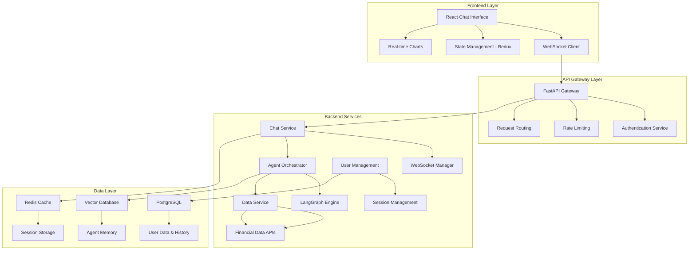
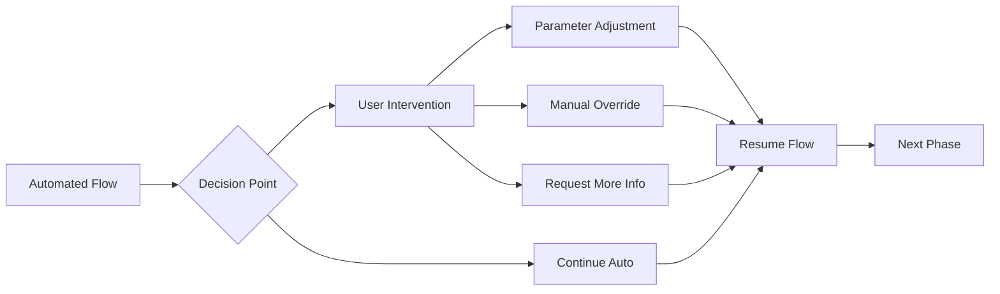

# TradingAgents Web-Based Chat Interface Upgrade Plan

## Executive Summary

This document outlines the comprehensive upgrade plan to transform the existing CLI-based TradingAgents system into a modern web-based chat interface. The upgrade will implement a **hybrid interaction mode** that combines automated multi-agent workflows with strategic user intervention points, enabling both efficiency and user control over critical trading decisions.

### Key Objectives
- Transform CLI interface to web-based chat system
- Preserve all existing multi-agent functionality
- Implement real-time streaming communication
- Enable user intervention at critical decision points
- Ensure scalability for multiple concurrent users
- Maintain data security and system reliability

---

## Current System Analysis

### Architecture Overview
The existing TradingAgents system is a sophisticated CLI-based multi-agent trading framework built with:

- **Frontend**: Rich library terminal UI with live updates and progress visualization
- **Backend**: LangGraph-based agent orchestration with complex state management
- **Agents**: 10+ specialized agents including analysts, researchers, traders, and risk managers
- **Data Sources**: Multiple financial data providers (Yahoo Finance, Alpha Vantage, Polygon, Finnhub, etc.)
- **Memory Systems**: Agent-specific memory for learning and context retention
- **Configuration**: YAML-based configuration with environment variable support

### Current Strengths
- ✅ Sophisticated multi-agent workflow orchestration
- ✅ Real-time data processing and analysis
- ✅ Complex debate systems between bull/bear researchers
- ✅ Comprehensive risk management framework
- ✅ Flexible configuration management
- ✅ Robust error handling and retry mechanisms

### Current Limitations
- ❌ CLI-only interface limits accessibility
- ❌ No web-based user interaction
- ❌ Limited concurrent user support
- ❌ No real-time collaboration features
- ❌ Difficult to integrate with web applications
- ❌ No mobile accessibility

---

## Proposed Web Architecture

### High-Level Architecture



### Technology Stack Recommendations

#### Frontend Stack
- **Framework**: React 18 with TypeScript
- **UI Library**: Material-UI (MUI) or Ant Design
- **State Management**: Redux Toolkit with RTK Query
- **Real-time Communication**: Socket.IO Client
- **Charts**: Recharts or Chart.js for financial data visualization
- **Styling**: Styled-components or Emotion

#### Backend Stack
- **API Framework**: FastAPI (Python) - maintains compatibility with existing codebase
- **WebSocket**: Socket.IO or native WebSocket with FastAPI
- **Agent Framework**: Keep existing LangGraph implementation
- **Database**: PostgreSQL for user data, Redis for caching and sessions
- **Message Queue**: Redis Pub/Sub or RabbitMQ for agent communication
- **Authentication**: JWT with refresh tokens

#### Infrastructure
- **Containerization**: Docker with Docker Compose
- **Reverse Proxy**: Nginx
- **Process Management**: Gunicorn with Uvicorn workers
- **Monitoring**: Prometheus + Grafana
- **Logging**: Structured logging with ELK stack

---

## Implementation Phases

### Phase 1: Foundation Setup (Weeks 1-3)
**Objective**: Establish basic web infrastructure and API foundation

#### Tasks:
1. **Project Structure Setup**
   - Create new web application structure
   - Set up Docker containerization
   - Configure development environment

2. **Backend API Development**
   - Implement FastAPI application structure
   - Create user authentication system
   - Set up database models and migrations
   - Implement basic WebSocket connection handling

3. **Frontend Foundation**
   - Initialize React application with TypeScript
   - Set up routing and basic layout
   - Implement authentication UI
   - Create basic chat interface components

#### Deliverables:
- Working authentication system
- Basic chat interface (no agent integration yet)
- WebSocket connection established
- Database schema implemented

### Phase 2: Agent Integration (Weeks 4-7)
**Objective**: Integrate existing LangGraph agents with web interface

#### Tasks:
1. **Agent Service Wrapper**
   - Create FastAPI service wrapper for existing agents
   - Implement agent state management for web sessions
   - Add WebSocket event handling for agent communications

2. **Real-time Communication**
   - Implement streaming agent responses
   - Create message queuing system for agent coordination
   - Add progress tracking and status updates

3. **Data Flow Integration**
   - Integrate existing data interfaces with web API
   - Implement caching layer for financial data
   - Add error handling and retry mechanisms

#### Deliverables:
- Agents accessible via web API
- Real-time streaming of agent responses
- Basic agent workflow execution through web interface

### Phase 3: Interactive Decision Points (Weeks 8-11)
**Objective**: Implement hybrid mode with user intervention capabilities

#### Tasks:
1. **Decision Point Framework**
   - Identify key intervention points in agent workflow
   - Create decision point UI components
   - Implement workflow pause/resume functionality

2. **Interactive Features**
   - Parameter adjustment interfaces
   - Agent selection and configuration
   - Manual override capabilities
   - Custom analysis requests

3. **Advanced Chat Features**
   - Multi-threaded conversations
   - Agent-specific chat channels
   - File upload and sharing
   - Export and reporting features

#### Deliverables:
- Fully interactive hybrid mode
- User intervention at key decision points
- Advanced chat interface with all features

### Phase 4: Enhancement & Optimization (Weeks 12-15)
**Objective**: Polish, optimize, and add advanced features

#### Tasks:
1. **Performance Optimization**
   - Implement efficient caching strategies
   - Optimize database queries
   - Add connection pooling and load balancing

2. **Advanced Features**
   - Multi-user collaboration
   - Saved analysis templates
   - Historical analysis comparison
   - Advanced visualization and reporting

3. **Security & Compliance**
   - Security audit and penetration testing
   - Implement comprehensive logging
   - Add compliance features for financial regulations

#### Deliverables:
- Production-ready system
- Advanced collaboration features
- Security and compliance implementation

---

## Interactive Decision Points Design

### Key Intervention Points

#### 1. Analysis Configuration
**When**: Before starting analysis
**User Options**:
- Select specific analysts to include
- Adjust analysis parameters (lookback days, data sources)
- Set risk tolerance levels
- Choose analysis depth (quick vs. comprehensive)

#### 2. Data Source Selection
**When**: During data gathering phase
**User Options**:
- Override automatic data source selection
- Add custom data sources or filters
- Adjust data quality thresholds
- Include/exclude specific news sources

#### 3. Research Debate Intervention
**When**: During bull/bear researcher debate
**User Options**:
- Extend or limit debate rounds
- Inject additional context or constraints
- Override debate conclusions
- Request specific analysis angles

#### 4. Trading Decision Review
**When**: Before final trading recommendation
**User Options**:
- Review and modify position sizing
- Adjust risk parameters
- Add custom constraints or conditions
- Request alternative scenarios

#### 5. Risk Management Override
**When**: During risk analysis phase
**User Options**:
- Modify risk assessment criteria
- Override risk recommendations
- Add custom risk factors
- Adjust position limits

### User Interface Design for Decision Points



---

## Best Practices Implementation

### 1. Real-time Communication Best Practices

#### WebSocket Management
```python
# Example WebSocket event structure
{
    "event_type": "agent_message",
    "agent_id": "market_analyst",
    "session_id": "user_session_123",
    "message": {
        "type": "analysis_update",
        "content": "Market analysis in progress...",
        "progress": 0.3,
        "timestamp": "2024-01-15T10:30:00Z"
    },
    "requires_user_input": false,
    "decision_point": null
}
```

#### Message Queue Architecture
- Use Redis Pub/Sub for real-time agent communication
- Implement message persistence for reliability
- Add message ordering and deduplication
- Include heartbeat and connection recovery

### 2. State Management Best Practices

#### Session State Structure
```python
{
    "session_id": "unique_session_id",
    "user_id": "user_123",
    "analysis_state": {
        "current_phase": "market_analysis",
        "completed_phases": ["data_gathering"],
        "agent_states": {...},
        "user_decisions": {...}
    },
    "configuration": {
        "selected_analysts": ["market", "news"],
        "risk_tolerance": "moderate",
        "custom_parameters": {...}
    }
}
```

#### Memory Management
- Implement agent memory persistence across sessions
- Use vector databases for semantic memory storage
- Add memory cleanup and archival policies
- Include memory sharing between related sessions

### 3. Security Best Practices

#### Authentication & Authorization
- Implement JWT with short-lived access tokens
- Use refresh token rotation
- Add role-based access control (RBAC)
- Include API rate limiting per user

#### Data Protection
- Encrypt sensitive financial data at rest
- Use HTTPS/WSS for all communications
- Implement data retention policies
- Add audit logging for all user actions

### 4. Scalability Best Practices

#### Horizontal Scaling
- Design stateless API services
- Use Redis for shared session storage
- Implement database connection pooling
- Add load balancing for WebSocket connections

#### Performance Optimization
- Implement intelligent caching strategies
- Use database query optimization
- Add CDN for static assets
- Include response compression

---

## Migration Strategy

### Phase 1: Parallel Development
- Develop web interface alongside existing CLI system
- Create API wrappers for existing agent functions
- Maintain backward compatibility with CLI

### Phase 2: Gradual Migration
- Start with read-only web interface for analysis viewing
- Add basic interaction capabilities
- Migrate user configurations and preferences

### Phase 3: Feature Parity
- Implement all CLI features in web interface
- Add web-specific enhancements
- Provide migration tools for existing users

### Phase 4: Deprecation Planning
- Announce CLI deprecation timeline
- Provide comprehensive migration documentation
- Offer user support during transition

---

## Security Considerations

### Authentication & Access Control
- Multi-factor authentication (MFA) support
- OAuth2/OpenID Connect integration
- Role-based permissions (Admin, Trader, Analyst, Viewer)
- Session management with automatic timeout

### Data Security
- End-to-end encryption for sensitive communications
- Secure API key management for financial data providers
- Regular security audits and vulnerability assessments
- Compliance with financial data regulations (SOX, GDPR)

### Infrastructure Security
- Container security scanning
- Network segmentation and firewalls
- Regular security updates and patches
- Intrusion detection and monitoring

---

## Scalability & Performance

### Horizontal Scaling Strategy
- Microservices architecture for independent scaling
- Load balancing across multiple application instances
- Database read replicas for improved performance
- CDN integration for global content delivery

### Performance Optimization
- Intelligent caching at multiple layers
- Database query optimization and indexing
- Asynchronous processing for long-running tasks
- Connection pooling and resource management

### Monitoring & Observability
- Real-time performance metrics
- Application and infrastructure monitoring
- User experience tracking
- Automated alerting and incident response

---

## Testing Strategy

### Unit Testing
- Comprehensive test coverage for all API endpoints
- Agent behavior testing with mock data
- WebSocket connection and message handling tests
- Database operation and migration tests

### Integration Testing
- End-to-end workflow testing
- Multi-agent interaction testing
- Real-time communication testing
- Third-party API integration testing

### Performance Testing
- Load testing for concurrent users
- Stress testing for peak usage scenarios
- WebSocket connection scalability testing
- Database performance under load

### User Acceptance Testing
- Interactive decision point testing
- User interface usability testing
- Cross-browser and device compatibility
- Accessibility compliance testing

---

## Deployment & DevOps

### Containerization Strategy
```dockerfile
# Example Docker setup
FROM python:3.11-slim
WORKDIR /app
COPY requirements.txt .
RUN pip install -r requirements.txt
COPY . .
EXPOSE 8000
CMD ["gunicorn", "main:app", "--worker-class", "uvicorn.workers.UvicornWorker"]
```

### CI/CD Pipeline
- Automated testing on code commits
- Container image building and scanning
- Staged deployment (dev → staging → production)
- Automated rollback capabilities

### Infrastructure as Code
- Docker Compose for local development
- Kubernetes manifests for production deployment
- Terraform for cloud infrastructure provisioning
- Ansible for configuration management

---

## Success Metrics & KPIs

### Technical Metrics
- System uptime and availability (target: 99.9%)
- Response time for API calls (target: <200ms)
- WebSocket connection stability (target: <1% disconnection rate)
- Concurrent user capacity (target: 1000+ simultaneous users)

### User Experience Metrics
- User adoption rate from CLI to web interface
- Session duration and engagement metrics
- Feature utilization rates
- User satisfaction scores

### Business Metrics
- Analysis completion rates
- Decision point interaction frequency
- Trading recommendation accuracy
- User retention and growth rates

---

## Risk Assessment & Mitigation

### Technical Risks
| Risk | Impact | Probability | Mitigation Strategy |
|------|--------|-------------|-------------------|
| WebSocket connection instability | High | Medium | Implement robust reconnection logic and fallback mechanisms |
| Database performance bottlenecks | High | Medium | Optimize queries, implement caching, use read replicas |
| Agent workflow failures | High | Low | Add comprehensive error handling and recovery mechanisms |
| Security vulnerabilities | High | Medium | Regular security audits, automated vulnerability scanning |

### Business Risks
| Risk | Impact | Probability | Mitigation Strategy |
|------|--------|-------------|-------------------|
| User resistance to change | Medium | High | Comprehensive training, gradual migration, user feedback integration |
| Feature parity gaps | High | Medium | Thorough requirements analysis, extensive testing |
| Performance degradation | High | Low | Load testing, performance monitoring, scalable architecture |

---

## Conclusion

This comprehensive upgrade plan transforms the TradingAgents CLI system into a modern, scalable web-based chat interface while preserving all existing functionality and adding powerful new interactive capabilities. The hybrid mode design ensures users maintain control over critical decisions while benefiting from automated workflows.

The phased implementation approach minimizes risk while delivering value incrementally. The proposed architecture follows industry best practices for security, scalability, and maintainability, ensuring the system can grow with user needs and market demands.

**Next Steps:**
1. Review and approve this upgrade plan
2. Assemble development team and assign roles
3. Set up development environment and infrastructure
4. Begin Phase 1 implementation
5. Establish regular progress reviews and stakeholder communication

The successful implementation of this plan will position TradingAgents as a cutting-edge, user-friendly platform that combines the power of AI-driven analysis with intuitive web-based interaction.